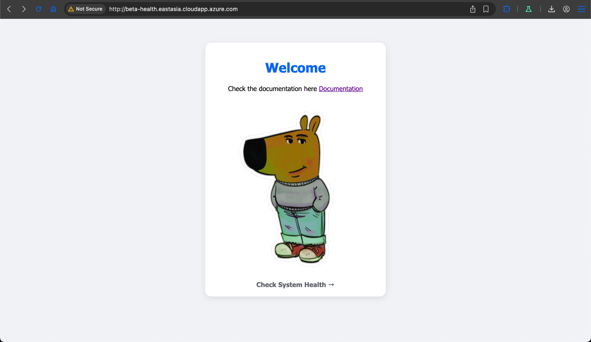
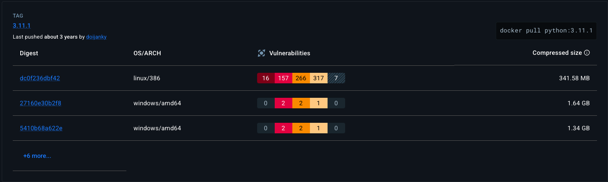
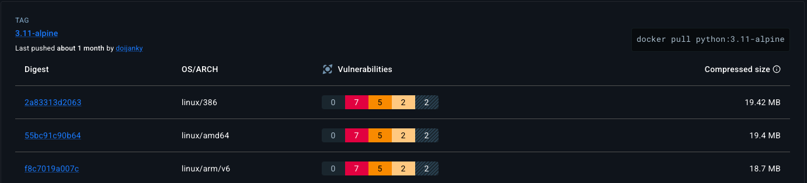
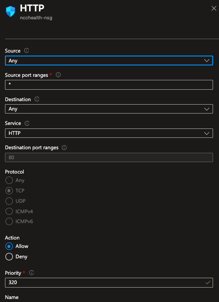
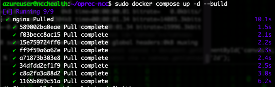
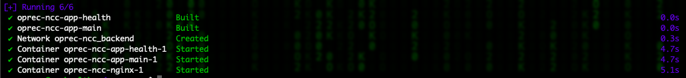
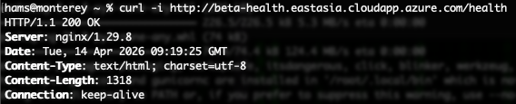

# Oprec NCC

| NRP | Nama |
| --- | ---- |
| 5025241152 | Bintang Ilham Pabeta |

# P1: Docker Oprec NCC 2026

> https://github.com/ncclaboratory18/Oprec_2026_Pertemuan_1

## Teknis Pengerjaan

- Membuat sebuah service sederhana dengan menyediakan endpoint /health untuk health check yang mengembalikan status sukses (misal: 200 OK)
- Service harus dijalankan menggunakan Docker dan dideploy ke Virtual Machine (VPS)

### Opsional (poin plus):

- Menggunakan multi-stage build pada Dockerfile
- Mengoptimasi ukuran image (misalnya menggunakan base image yang ringan seperti alpine)
- Menambahkan instruction HEALTHCHECK pada Dockerfile
- Menggunakan docker-compose untuk menjalankan service
- Mengatur environment variable di Docker (ENV / .env)
- Menggunakan .dockerignore untuk optimasi build context
- Menambahkan restart policy pada container
- Melakukan port configuration yang rapi dan jelas
- Memberikan struktur Dockerfile yang clean dan best practice

# Laporan Penugasan-1: Docker

> http://beta-health.eastasia.cloudapp.azure.com/health

## 1. Arsitektur Sistem
Sistem ini dirancang menggunakan arsitektur *microservices* sederhana dengan Nginx sebagai *Reverse Proxy* yang mengatur *routing* trafik ke dua *container* aplikasi Flask yang berjalan secara independen:
- **App-Main**: Menangani trafik utama pada *root endpoint* (`/`).

    

- **App-Health**: Menangani *health check* secara khusus pada *endpoint* (`/health`).

    

## 2. Implementasi Service

### 2.1 Flask Application (`app/main.py`)
Aplikasi dibangun menggunakan Python Flask dan dijalankan menggunakan `gunicorn` untuk standar *production*. Logika aplikasi digabung dalam satu basis kode, namun dipisahkan perannya menggunakan *Environment Variable* (`SERVICE_TYPE`) untuk menghindari duplikasi kode (*DRY principle*).

### 2.2 Nginx sebagai Reverse Proxy (`nginx/default.conf.template`)
Nginx digunakan untuk menerima request dari publik (Port 80) dan meneruskannya ke jaringan internal Docker. Konfigurasi dibuat dinamis menggunakan template bawaan Nginx (`envsubst`), sehingga *port* yang digunakan tidak *hardcoded* melainkan mengambil dari `.env`.

### 2.3 Dockerfile & Optimasi Image
Pembuatan *image* Docker mengimplementasikan beberapa *best practice*:
- **Base Image Ringan**: Menggunakan `python:3.11-alpine` untuk meminimalisir ukuran *image* akhir.
    
    | Python3.11 | Python3.11-alpine |
    | --- | --- |
    |  |  |

- **Multi-stage Build**: Menggunakan tahapan `builder` untuk menginstal dependensi (`requirements.txt`), sehingga *layer* pada tahap *runtime* tetap bersih dari *cache* dan *tools build* yang tidak diperlukan.
- **Instruction HEALTHCHECK**: Menambahkan perintah native Docker `HEALTHCHECK` untuk memantau status kontainer secara berkala dengan interval 30 detik.

### 2.4 Docker Compose & Environment Variables
Proses orkestrasi dan interaksi antar *container* diatur menggunakan `docker-compose.yml`:
- **Restart Policy**: Menggunakan `restart: always` agar *service* otomatis bangkit kembali jika VM di-*reboot* atau terjadi *crash*.
- **Port Configuration**: Hanya port 80 pada Nginx yang di-*expose* ke publik (VPS). Port 6969 dan 6767 milik Flask disembunyikan dan hanya berkomunikasi via jaringan internal Docker (`backend` network).
- **Environment Variables**: Menggunakan file `.env` terpusat untuk mengatur variabel `PORT` dan konfigurasi Nginx.

### 2.5 Optimasi Build Context (`.dockerignore`)
File `.dockerignore` ditambahkan untuk mengecualikan direktori seperti `__pycache__`, environment virtual (`venv`), dan `.git` agar proses *build* berjalan lebih cepat dan ukuran *context* tetap kecil.

---

## 3. Deployment ke Virtual Machine (VPS)

### Langkah-langkah Eksekusi:

1. **Persiapan VPS & Keamanan Dasar**: 
   - Melakukan *provisioning* Virtual Machine dengan OS Linux.
        
        Pada kasus ini, kita hanya perlu untuk melakukan instalasi docker menggunakan
        
        ```bash
        sudo snap install docker
        ```

        Selebihnya dependency akan diinstall pada container docker yang sudah diatur pada Dockerfile yang ada.

   - Mengatur *Firewall* (Inbound Rules) untuk hanya membuka **Port 80 (HTTP)** untuk publik, dan membatasi akses Port 22 (SSH).

        

2. **Kloning Repository**:
   ```bash
   git clone https://github.com/ilhmpbta/oprec-ncc/
   cd oprec-ncc
   ```

3. Build dan Run Service:
   ```bash
   docker compose up -d --build
   ```

   
   

4. Verifikasi Service (200 OK)
   ```bash
   curl -I http://beta-health.eastasia.cloudapp.azure.com/health
   ```

   