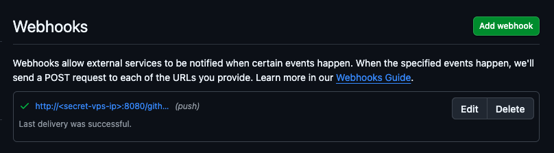
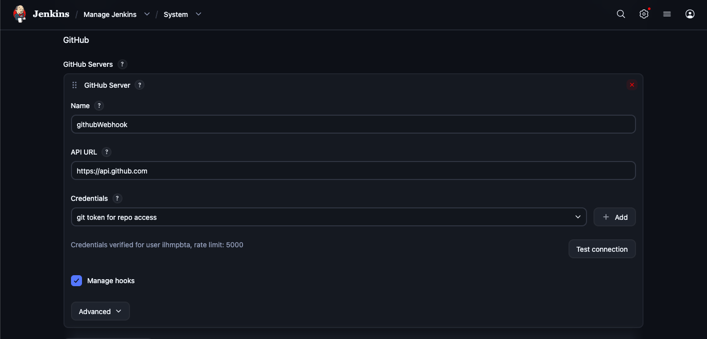
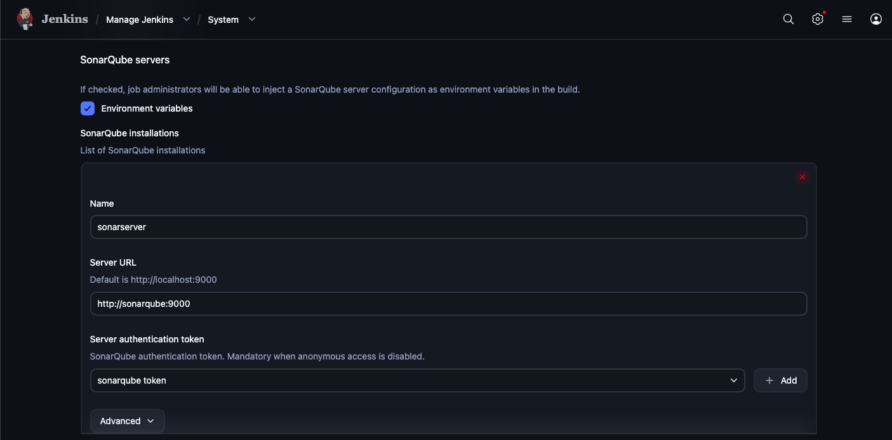
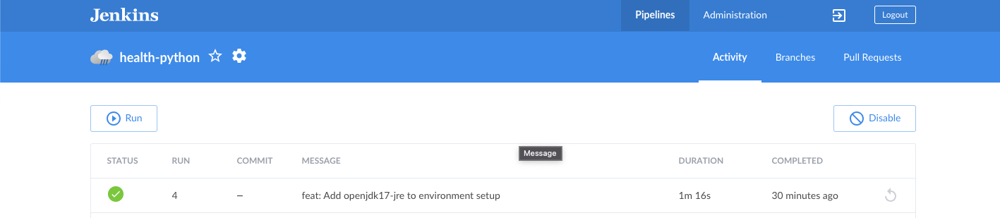
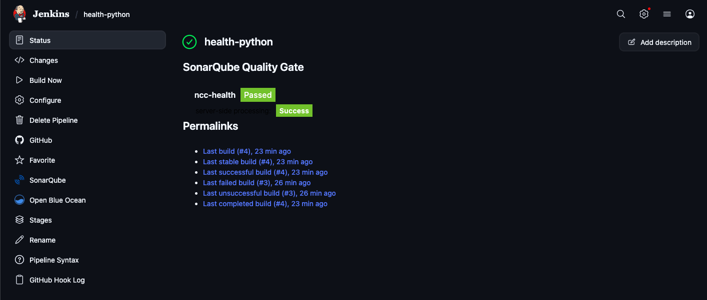
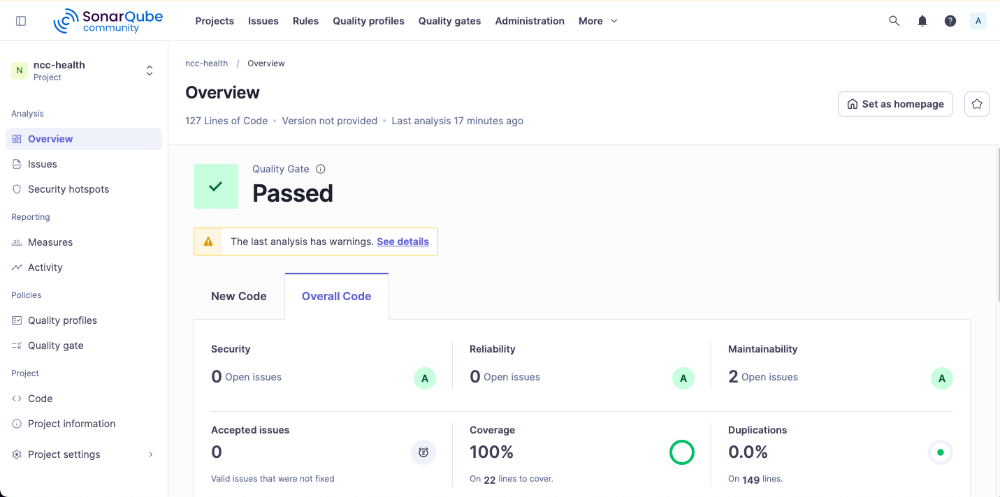
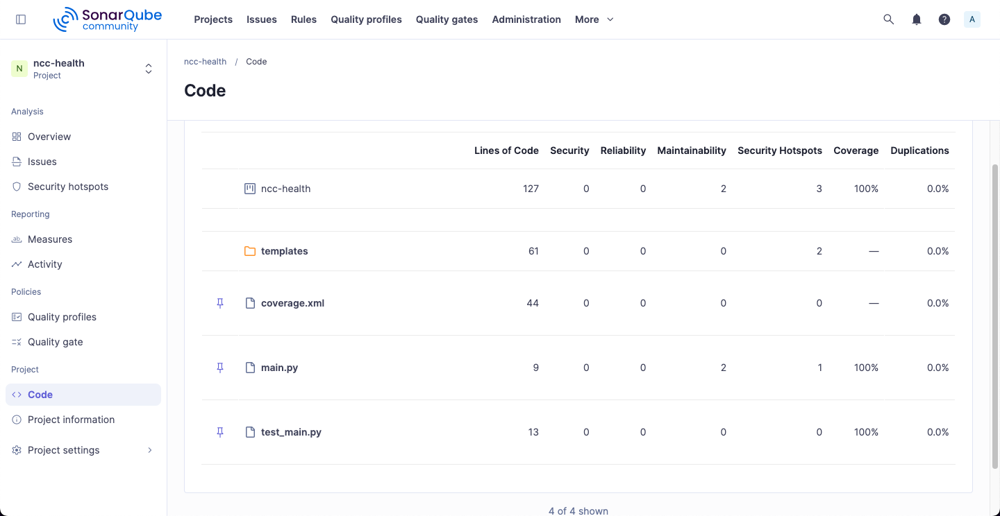
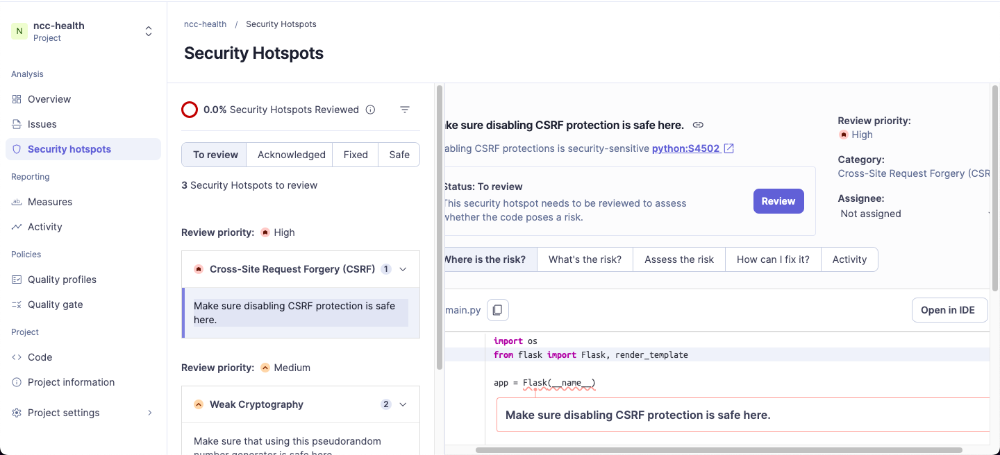
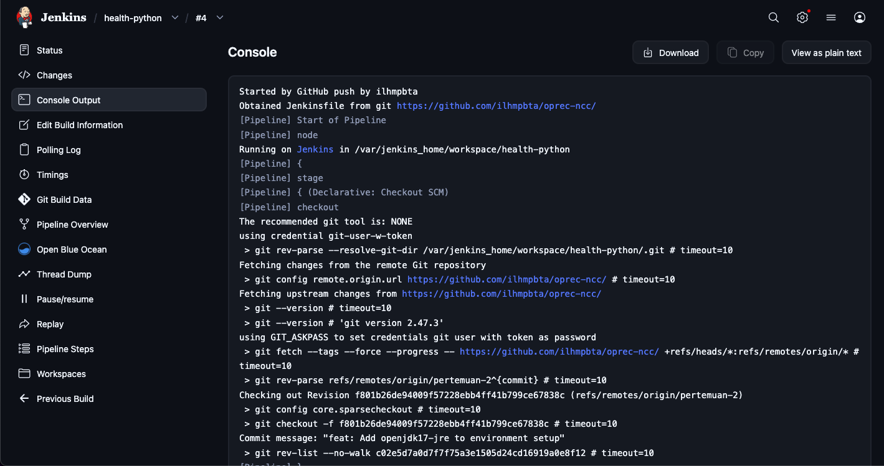

# Oprec NCC

| NRP | Nama |
| --- | ---- |
| 5025241152 | Bintang Ilham Pabeta |

# P2: CI/CD Oprec NCC 2026

> https://github.com/ncclaboratory18/Oprec_2026_Pertemuan_2

## Teknis Pengerjaan

- Menyiapkan Jenkins sebagai tools automation
- Menyiapkan SonarQube sebagai tools code quality analysis
- Menghubungkan Jenkins dengan SonarQube dan membuat pipeline

## Opsional (poin plus):

- Menggunakan Jenkins Pipeline (Jenkinsfile) dibanding freestyle
- Menambahkan stage terstruktur (build, test, analyze) dengan SonarQube Quality Gate untuk menggagalkan - pipeline jika standar kualitas tidak terpenuhi
- Mengintegrasikan dengan webhook (trigger otomatis saat push)
- Menggunakan environment variable / credential management di Jenkins
- Menampilkan badge/status build
- Optimasi pipeline (parallel stage atau caching sederhana)

# Laporan Penugasan-2:CI/CD

## 1. Deskripsi Pipeline
Pipeline ini adalah sebuah *Continuous Integration* (CI) berarsitektur *Docker-outside-of-Docker* (DooD) yang didefinisikan secara deklaratif menggunakan `Jenkinsfile`. Pipeline dirancang untuk mengotomatisasi proses pengujian dan analisis kualitas kode untuk aplikasi berbasis Python (Flask).

*Docker-outside-of-Docker* (Dood) digunakan karena pada VPS B2ms (4GB RAM) jauh lebih efisien untuk menghindari overhead memori dari daemon Docker ganda yang ada pada DinD, sehingga sisa RAM yang terbatas bisa dialokasikan sepenuhnya untuk menjalankan SonarQube yang cukup haus sumber daya. Selain itu, DooD memungkinkan Jenkins berbagi image cache langsung dengan host, yang mempercepat proses build dan menghemat ruang penyimpanan serta bandwidth pada spesifikasi vCPU yang kecil.

Pipeline ini mengimplementasikan seluruh standar *best practice* dan poin opsional (plus), meliputi:
* **Infrastructure as Code:** Menggunakan `Jenkinsfile` daripada konfigurasi *Freestyle*.
* **Dockerized Agent:** Menggunakan *agent* `python:3.11-alpine` yang di- *spin-up* secara dinamis untuk memastikan isolasi *environment*.
* **Optimasi Caching:** Menggunakan Docker volume (`jenkins-pip-cache:/root/.cache/pip`) untuk menyimpan *cache* *dependencies* Python agar proses *build* selanjutnya lebih cepat.
* **Parallel Execution:** Menjalankan *Unit Testing* (`pytest`) dan *Code Linting* (`flake8`) secara bersamaan untuk memangkas waktu eksekusi.
* **Automation Trigger:** Terintegrasi penuh dengan GitHub Webhook (otomatis *running* saat ada *push* ke *repository*).
* **Credential Management:** Menggunakan Jenkins Global Credentials untuk menyimpan GitHub *Personal Access Token* secara aman.
* **Build Badge:** Menggunakan *Embeddable Build Status* untuk menampilkan status *passing/failing* langsung di `README.md` repositori.

## 2. Penjelasan Integrasi Jenkins dengan SonarQube
Integrasi dilakukan menggunakan *plugin* **SonarQube Scanner** di dalam Jenkins. Konfigurasi integrasi diatur pada level sistem Jenkins (menyimpan URL server SonarQube dan *Authentication Token*) serta pada level *Tools* (menginstal SonarScanner secara otomatis).

Pada sisi `Jenkinsfile`, integrasi dipanggil melalui *environment variables* `SONARQUBE_ENV` dan konfigurasi *tool* `SCANNER_HOME`. Karena Jenkins dan SonarQube berjalan di atas *custom Docker network* (`jenkins`), *agent* Python diinstruksikan untuk menggunakan *network* yang sama (`--network jenkins`) agar dapat mengirimkan hasil analisis (`coverage.xml`) ke *endpoint* SonarQube Server. Pipeline juga menerapkan **Quality Gate**, di mana Jenkins akan melakukan *polling* ke SonarQube (maksimal 10 menit) untuk menunggu hasil analisis; jika kode tidak memenuhi standar kelulusan SonarQube, pipeline akan otomatis berstatus *Failed* (menggagalkan proses *deployment* lebih lanjut).

## 3. Screenshot Konfigurasi Jenkins dan SonarQube

1. Halaman konfigurasi Webhook di GitHub.
   

2. Setup GitHub server di Jenkins.
   

3. Halaman pengaturan SonarQube Server di Jenkins (*Manage Jenkins > System*).
   

4. Tampilan Jenkins yang menunjukkan *Parallel Stages* berjalan sukses.
   
   


## 4. Screenshot Hasil Analisis Kode di SonarQube

1. *Dashboard* proyek `ncc-health` di SonarQube yang menunjukkan status **Passed**.
   
2. Tampilan persentase *Coverage* yang menunjukkan metrik 100%.
   
3. Security Analysis dari SonarQube
   

## 5. Penjelasan Alur Pipeline (Flow)
Alur pipeline terdiri dari tahapan terstruktur berikut:

0. Webhook Trigger
   > Started by GitHub push by ilhmpbta
   
      
1. **Checkout:** Jenkins menerima *trigger* dari GitHub Webhook, lalu melakukan fungsi `checkout scm` untuk mengunduh kode terbaru dari repositori.
   ```
   stage('Checkout') {
         steps {
            checkout scm
         }
   }
   ```

2. **Setup Environment:** Pipeline menginstal *dependencies* sistem Alpine (`gcc`, `musl-dev`) dan *Java Runtime Environment* (`openjdk17-jre`) yang diwajibkan oleh SonarScanner. Selanjutnya, mengeksekusi `pip install` untuk mengunduh paket aplikasi dan *tools* pengujian.
   ```
   stage('Setup Environment') {
         steps {
            sh 'apk add --no-cache gcc musl-dev openjdk17-jre'
            sh 'pip install -r requirements.txt pytest pytest-cov flake8'
         }
   }
   ```

3. **Verification (Parallel):**
   * **Unit Tests & Coverage:** Menjalankan `pytest` dengan simulasi *web request* (menggunakan Flask *test client*) dan mencetak *output* `coverage.xml`.
      ```
      stage('Unit Tests & Coverage') {
         steps {
               sh 'pytest --cov=. --cov-report=xml'
         }
      }
      ```

   * **Code Linting:** Menjalankan `flake8` untuk memeriksa kepatuhan format kode terhadap standar PEP-8.
      ```
      stage('Code Linting') {
         steps {
            sh 'flake8 . --exit-zero'
         }
      }
      ```

4. **SonarQube Analysis:** Menggunakan eksekusi `sonar-scanner` untuk memindai *source code* dan memproses `coverage.xml`, lalu mengirimkan laporannya ke *server* SonarQube.
   ```
   withSonarQubeEnv("${SONARQUBE_ENV}") {
      sh """
         ${SCANNER_HOME}/bin/sonar-scanner \
            -Dsonar.projectKey=ncc-health \
            -Dsonar.projectName=ncc-health \
            -Dsonar.sources=. \
            -Dsonar.python.coverage.reportPaths=coverage.xml
      """
   }
   ```

5. **Quality Gate:** Jenkins menjeda pipeline dan melakukan `waitForQualityGate`. Memastikan metrik analisis lolos kriteria sebelum memberikan status sukses secara keseluruhan.
   ```
   stage('Quality Gate') {
      steps {
            timeout(time: 10, unit: 'MINUTES') {
               waitForQualityGate abortPipeline: true
            }
      }
   }
   ```

6. **Post Actions:** Mengirimkan *feedback* log (Pipeline Sukses/Gagal) ke *console*.
   ```
   post {
         success {
               echo 'Pipeline Sukses! Check SonarQube for Code Quality.'
         }
         failure {
               echo 'Pipeline Gagal!'
         }
      }
   ```

## 6. Kendala yang Dihadapi dan Solusi
Dalam proses implementasi, terdapat beberapa kendala teknis yang telah berhasil diselesaikan:
1. **DooD Volume Overwrite Trap:** Saat mendefinisikan *Docker agent*, penggunaan argumen *volume mount* (`-v /var/jenkins_home/tools:/var/jenkins_home/tools`) menyebabkan direktori instalasi SonarScanner tertimpa oleh *empty folder* dari sistem *host*. 
   > **Solusi:** Menghapus instruksi *mount* tersebut dan membiarkan *agent* mewarisi instalasi *tools* melalui instruksi `--volumes-from` bawaan Jenkins.
2. **Network Isolation Timeout:** *Agent* (container Golang/Python yang dibuat *on-the-fly*) berada pada *default bridge network*, sehingga gagal mengenali *hostname* `sonarqube` saat mencoba mengirim laporan. 
   > **Solusi:** Menambahkan parameter `--network jenkins` di `Jenkinsfile` agar *container* sementara tersebut masuk ke *network* yang sama.
3. **Out of Memory (OOM) Kernel Panic:** RAM VPS berkapasitas ~4GB terkuras habis saat *Compute Engine* SonarQube memproses laporan ZIP, mengakibatkan *server crash* dan tidak responsif. 
   > **Solusi:** Membuat file *Swap* berkapasitas 4GB di level OS Linux untuk menangani lonjakan memori secara temporer.
4. **Missing Java Dependency:** Penggunaan *base image* `python:3.11-alpine` menyebabkan SonarScanner gagal berjalan karena absennya JRE (Java Runtime Environment). 
   > **Solusi:** Menginjeksi instalasi `openjdk17-jre` melalui `apk add` pada *stage* eksekusi `Setup Environment`.