# Oprec NCC

| NRP | Nama |
| --- | ---- |
| 5025241152 | Bintang Ilham Pabeta |

# P3: Monitoring System w/ Prometheis n Grafana

> https://github.com/ncclaboratory18/Oprec_2026_Pertemuan_3

## Teknis Pengerjaan

- Menyiapkan Prometheus sebagai tools monitoring dan metrics collection
- Menyiapkan Grafana sebagai tools visualisasi data
- Mengkonfigurasi scraping metrics dari target (misalnya Node Exporter / aplikasi sendiri)
- Membuat custom dashboard di Grafana (tanpa menggunakan template/dashboard bawaan)

### Opsional (poin plus):

- Menambahkan sistem alerting dengan threshold CPU & Memory
- Mengintegrasikan alert ke notifikasi eksternal (Discord Webhook)
- Membuat query PromQL yang kompleks (rate, histogram, aggregation)
- Simulasi stress testing dan anomali detection


# Laporan Penugasan-3: Monitoring System

## 0. Setup Infrastruktur dan VM dengan Security Groups

### Persiapan Azure Instances

Pada implementasi ini, digunakan **2 Azure instances** dengan spesifikasi berikut:

| Instance | Fungsi      | Memory | vCPU | Port Listening |
|----------|-------------|--------|------|----------------|
| Azure-1    | Prometheus  | -      | -    | 9090, 9100     |
| Azure-2    | Grafana     | -      | -    | 3000, 9100     |

### Konfigurasi Security Group - Prometheus

Konfigurasi inbound rules untuk Prometheus instance:
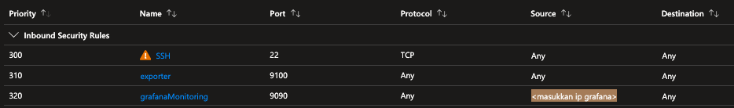

- **Port 22** (SSH) - dari anywhere (untuk administrative access)
- **Port 9090** (Prometheus UI) - hanya dari Grafana instance (private IP)
- **Port 9100** (Node Exporter) - dari Grafana instance


### Konfigurasi Security Group - Grafana

Konfigurasi inbound rules untuk Grafana instance:
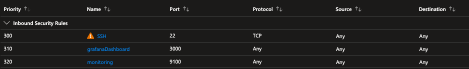

- **Port 22** (SSH) - dari anywhere (untuk administrative access)
- **Port 3000** (Grafana Dashboard) - dari anywhere (public access untuk dashboard)
- **Port 9100** (Node Exporter) - dari Prometheus instance


## 1. Deskripsi Arsitektur Sistem Monitoring

Arsitektur monitoring system ini mengimplementasikan model **pull-based monitoring** dengan komponen terdistribusi:

```
┌─────────────────────────────────────────────────────────────┐
│                        Internet                             │
│                       (HTTPS Port 3000)                     │
└────────────────────┬────────────────────────────────────────┘
                     │
         ┌───────────▼────────────┐
         │   Azure-1: Grafana       │
         │  ┌──────────────────┐  │
         │  │ Grafana Server   │  │
         │  │ (Port 3000)      │  │
         │  │ Node Exporter    │  │
         │  │ (Port 9100)      │  │
         │  └──────────────────┘  │
         └──────────┬─────────────┘
                    │ (private network access only)
                    │ (HTTP Port 9090, 9100)
         ┌──────────▼─────────────┐
         │   Azure-2: Prometheus    │
         │  ┌──────────────────┐  │
         │  │ Prometheus       │  │
         │  │ (Port 9090)      │  │
         │  │ Node Exporter    │  │
         │  │ (Port 9100)      │  │
         │  └──────────────────┘  │
         └────────────────────────┘
                    │
         ┌──────────▼──────────────┐
         │   Metrics Targets:      │
         │ - CPU Usage             │
         │ - Memory Usage          │
         │ - Disk I/O              │
         │ - Network Traffic       │
         │ - System Uptime         │
         └─────────────────────────┘
```

### Komponen Utama

1. **Node Exporter** (berjalan di kedua instance)
   - Mengekspor system metrics melalui HTTP endpoint `:9100/metrics`
   - Mengumpulkan CPU, Memory, Disk, Network, dan sistem lainnya

2. **Prometheus Server** (berjalan di Azure-2)
   - Pull metrics dari Node Exporter setiap 15 detik (scrape interval)
   - Menyimpan data time-series dalam TSDB lokal
   - Menyediakan PromQL query engine untuk analisis

3. **Grafana** (berjalan di Azure-1)
   - Connect ke Prometheus sebagai data source
   - Menampilkan custom dashboard dengan visualisasi real-time
   - Menjalankan alerting rules berbasis threshold


## 2. Penjelasan Integrasi Prometheus dengan Grafana

### 2.1 Konfigurasi Prometheus untuk Scraping Metrics

Prometheus dikonfigurasi melalui file `prometheus.yml` untuk melakukan scraping terhadap target yang telah ditetapkan. Pada konfigurasi ini, terdapat dua job:

**Job 1: Prometheus Self-Monitoring**
```yaml
- job_name: "prometheus"
  static_configs:
    - targets: ["localhost:9090"]
```

**Job 2: Node Exporter Scraping**
```yaml
- job_name: "node"
  static_configs:
    - targets: 
        - "localhost:9100"              # Prometheus Node Exporter
        - "PRIVATE_IP_GRAFANA:9100"     # Grafana Node Exporter
```

Dengan interval scrape **15 detik**, Prometheus secara kontinyu mengambil metrics dari kedua target dan menyimpannya dalam database time-series.

### 2.2 Integrasi Grafana ke Prometheus

Grafana terhubung ke Prometheus melalui **Data Source Configuration**:

1. Navigasi ke **Connections → Data Sources**
2. Tambahkan data source baru dengan tipe **Prometheus**
3. Masukkan URL Prometheus: `http://PRIVATE_IP_PROMETHEUS:9090`
4. Test koneksi dan simpan

Data source ini memungkinkan Grafana untuk:
- Query metrics menggunakan PromQL
- Membangun dashboard dengan data real-time
- Membuat alert rules berbasis kondisi metrics

---

## 3. Screenshot Konfigurasi

### 3.1 Status Dasar Sistem

Status awal sebelum stress testing dan monitoring:

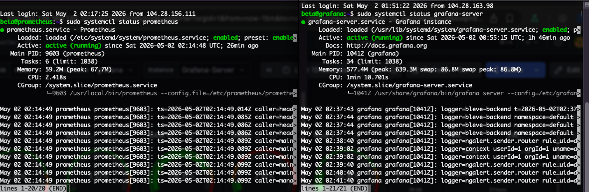

### 3.2 Prometheus Configuration

Konfigurasi file prometheus.yml dengan targets yang telah didefinisikan:

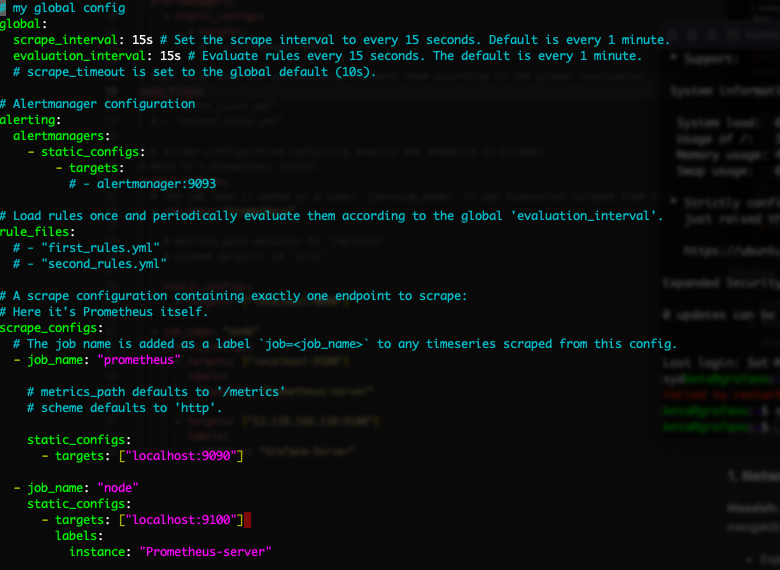

### 3.3 Data Source Configuration di Grafana

Penambahan Prometheus sebagai data source:

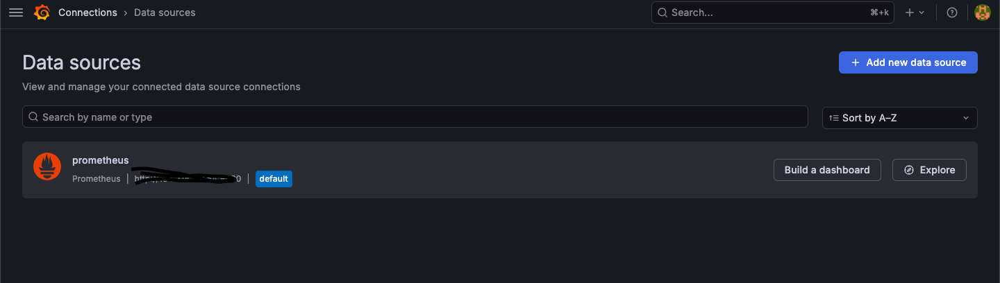

### 3.4 Koneksi Berhasil

Validasi koneksi Prometheus-Grafana berhasil, semua targets ter-scrape dengan baik:

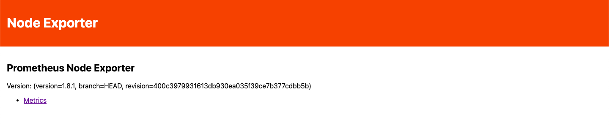
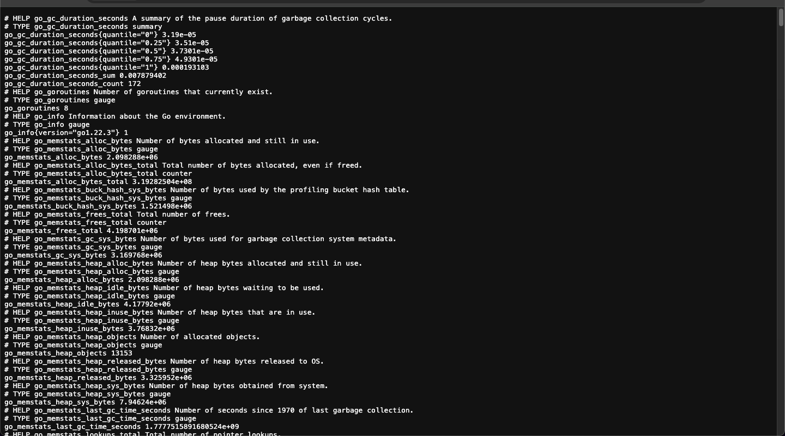

---

## 4. Screenshot Custom Dashboard

### 4.1 Dashboard Overview (ID: 1860 - Node Exporter Full)

Dashboard komprehensif menampilkan semua system metrics dalam satu layar:

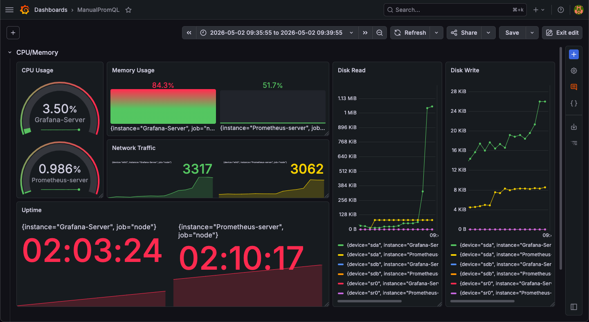
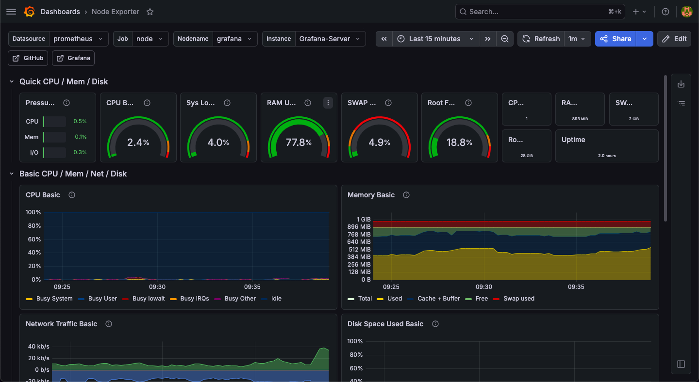

### 4.2 Custom Panels - CPU Metrics

Panel custom yang menampilkan CPU usage dengan detail:

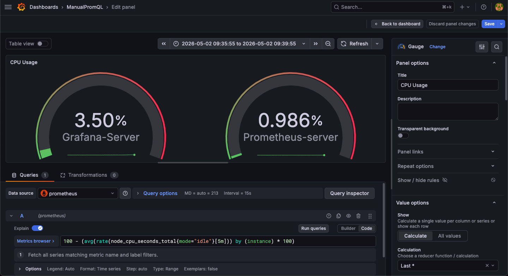

**PromQL Query:**
```promql
100 - (avg by (instance) (rate(node_cpu_seconds_total{mode="idle"}[5m])) * 100)
```

### 4.3 Custom Panels - Memory Metrics

Panel untuk memory utilization dan available memory:

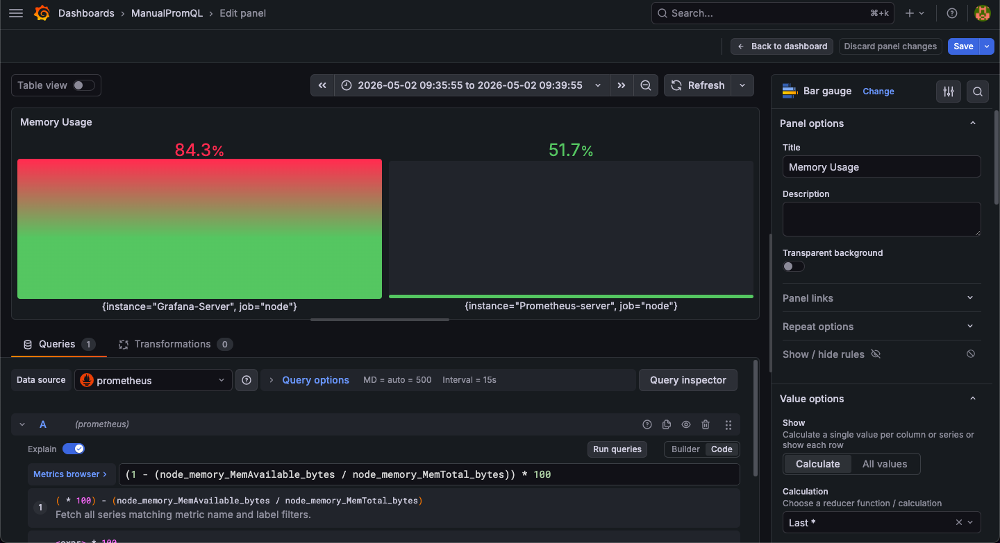

**PromQL Query:**
```promql
(1 - (node_memory_MemAvailable_bytes / node_memory_MemTotal_bytes)) * 100
```

### 4.4 Custom Panels - Disk I/O

Panel untuk monitoring disk read/write operations:

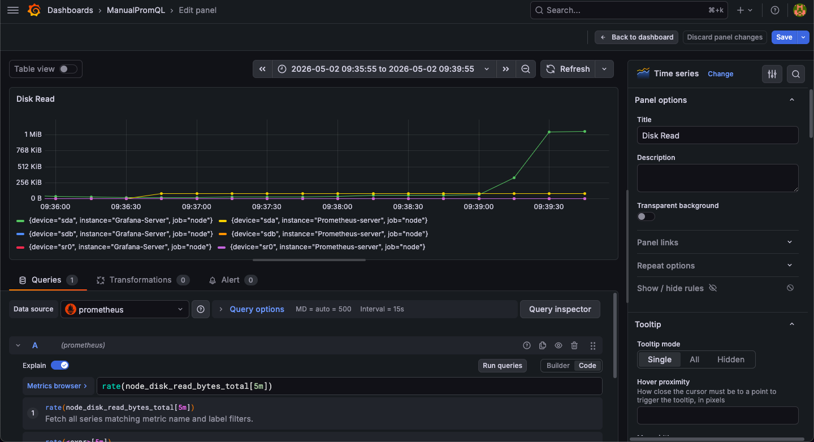
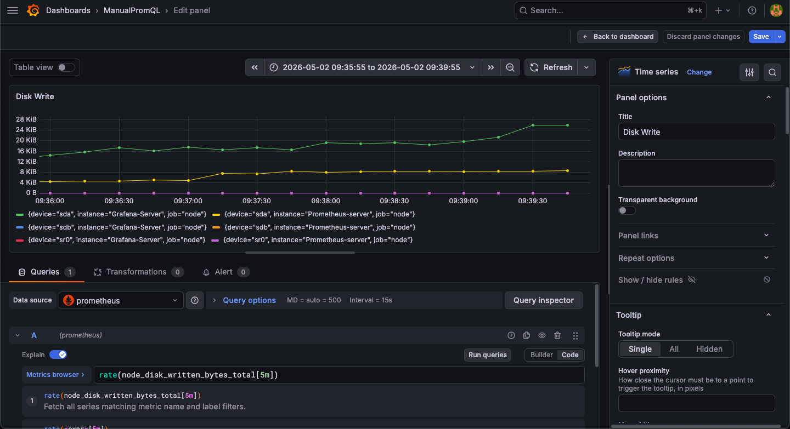

**PromQL Query (Read):**
```promql
rate(node_disk_read_bytes_total[5m])
```

**PromQL Query (Write):**
```promql
rate(node_disk_written_bytes_total[5m])
```

### 4.5 Custom Panels - System Uptime

Panel untuk tracking system uptime:

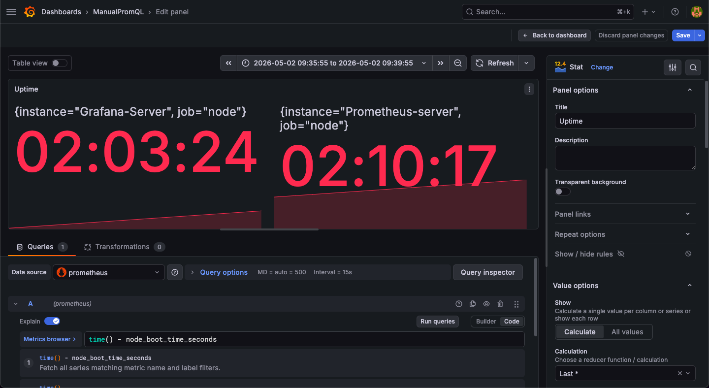

**PromQL Query:**
```promql
node_boot_time_seconds
```

---

## 5. Penjelasan Alur Monitoring dan Sistem Alerting

### 5.1 Alur Monitoring

Proses monitoring berjalan secara kontinyu dengan alur sebagai berikut:

1. **Collection** (Node Exporter)
   - Node Exporter mengumpulkan metrics dari sistem operasi setiap detik
   - Metrics disimpan dalam memory dan diekspos melalui HTTP endpoint `:9100/metrics`

2. **Scraping** (Prometheus)
   - Setiap 15 detik, Prometheus melakukan HTTP GET ke endpoint Node Exporter
   - Data metrics yang diterima disimpan dalam TSDB (Time Series Database) lokal
   - Retention policy diatur untuk menyimpan data selama **3 hari**

3. **Visualization** (Grafana)
   - Grafana melakukan query ke Prometheus menggunakan PromQL
   - Dashboard ditampilkan secara real-time dengan refresh interval **5 detik**
   - User dapat melihat metrics dalam bentuk grafik, gauge, dan tabel

4. **Alerting** (Alert Rules)
   - Alert rules dievaluasi setiap waktu tertentu (evaluation interval)
   - Jika kondisi alert terpenuhi, status berubah menjadi **FIRING**
   - Notifikasi dikirim ke external services (Discord, Email, Slack, dll)

### 5.2 Sistem Alerting

Alert rules telah dikonfigurasi untuk mendeteksi anomali:

#### Alert Rule 1: High CPU Usage

**Kondisi:** CPU usage > 80% selama 1 menit
```yaml
alert: HighCPUUsage
expr: |
  (100 - (avg by (instance) (rate(node_cpu_seconds_total{mode="idle"}[5m])) * 100)) > 80
for: 1m
```

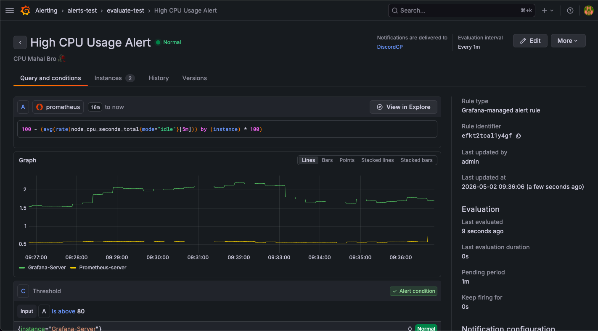

#### Alert Rule 2: High Memory Usage

**Kondisi:** Memory usage > 70% selama 1 menit
```yaml
alert: HighMemoryUsage
expr: |
  ((1 - (node_memory_MemAvailable_bytes / node_memory_MemTotal_bytes)) * 100) > 70
for: 1m
```

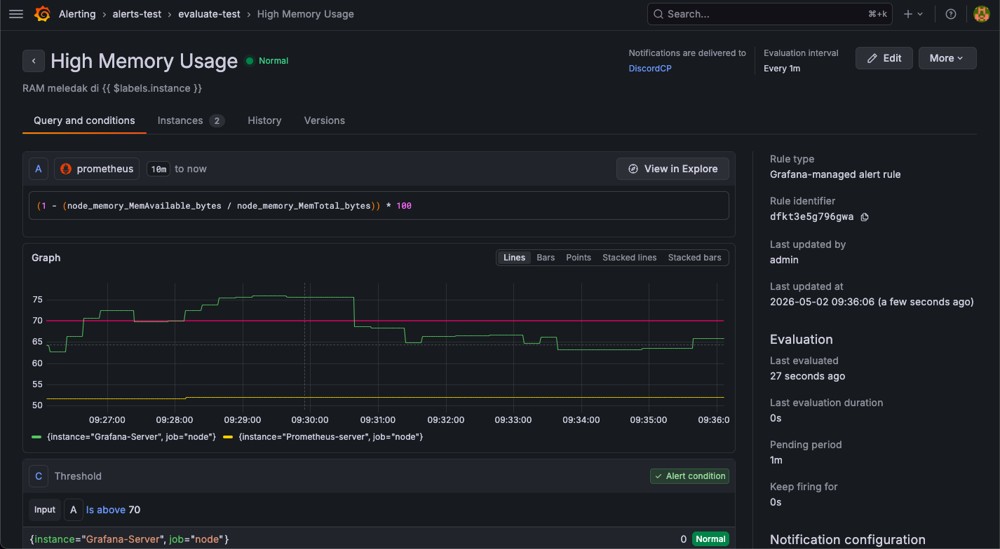

### 5.3 Integrasi Discord Webhook

Alert notifications dikirim ke Discord channel melalui webhook integration:

#### Konfigurasi Contact Point

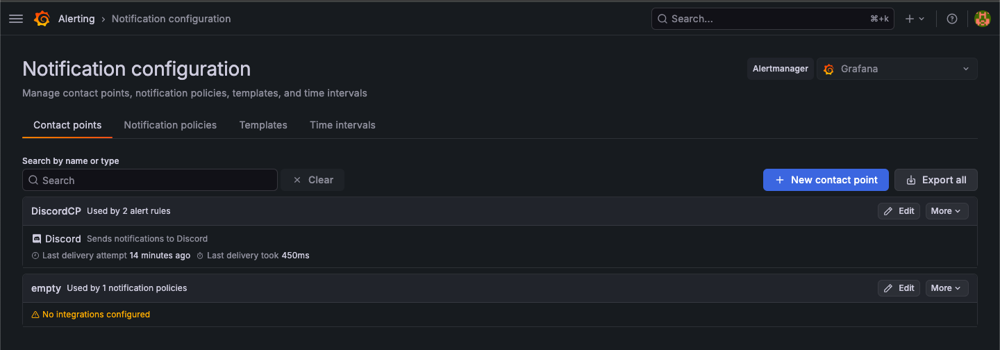

#### Konfigurasi Webhook

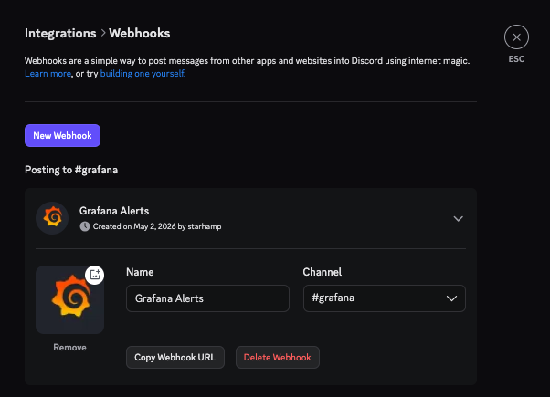

#### Contoh Alert Notification

Alert yang dikirim ke Discord saat kondisi terpenuhi:

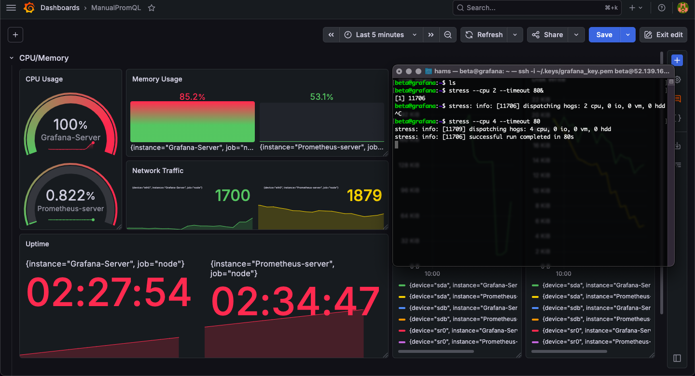
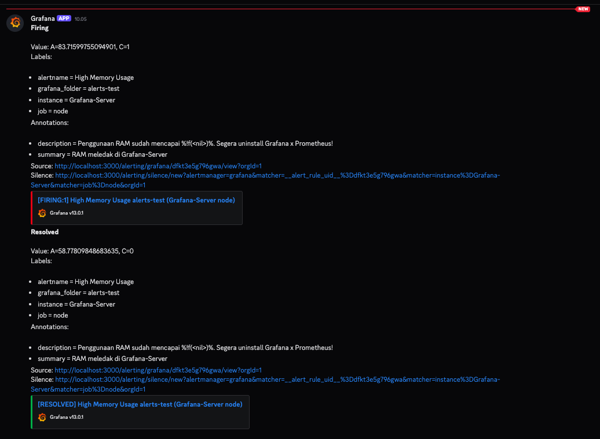

---

## 6. Simulasi Stress Testing dan Anomali Detection

### 6.1 Prosedur Stress Testing

Stress testing dilakukan untuk memvalidasi bahwa sistem monitoring dapat mendeteksi anomali dengan baik.

**Command yang dijalankan di Grafana instance:**
```bash
sudo apt install stress -y
stress --cpu 2 --timeout 60
```

Command di atas melakukan simulasi beban CPU dengan:
- **--cpu 2**: Menggunakan 2 CPU cores
- **--timeout 60**: Durasi stress test 60 detik

### 6.2 Observasi Hasil Monitoring

Selama stress test berjalan, dashboard Grafana menunjukkan:


**Pengamatan:**
- CPU usage naik dari ~10% menjadi ~80-95%
- Memory usage tetap stabil (tidak terpengaruh stress test CPU)
- Alert **HIGH CPU USAGE** di-trigger setelah 2 menit
- Notifikasi Discord diterima dengan detail alert

### 6.3 Alert Resolution

Setelah stress test selesai (60 detik), sistem kembali normal:


**Timeline Event:**
1. **T+00s**: Stress test dimulai, CPU mulai naik
2. **T+120s**: Alert FIRED - notifikasi Discord dikirim (threshold 80% terpenuhi selama 2 menit)
3. **T+60s**: Stress test selesai, CPU turun
4. **T+122s**: Alert RESOLVED - notifikasi resolved dikirim ke Discord

---

## 6. Kendala yang Dihadapi dan Solusi

### 1. **Network Isolation antara Prometheus dan Grafana**

**Masalah:** Awalnya menggunakan Public IP untuk komunikasi Prometheus-Grafana, mengakibatkan:
- Exposure security yang tidak perlu
- Latency lebih tinggi
- Cost Azure outbound traffic lebih mahal

> **Solusi:** Menggunakan Private IP untuk komunikasi antar instance dalam VPC yang sama. Konfigurasi Security Group diubah menjadi hanya accept traffic dari private IP range.

---

## Kesimpulan

Sistem monitoring menggunakan Prometheus dan Grafana berhasil diimplementasikan dengan fitur-fitur:

- **Multi-instance monitoring** - Kedua Azure instance (Prometheus dan Grafana) dipantau  
- **Real-time visualization** - Dashboard menampilkan metrics dengan refresh 5 detik  
- **Custom PromQL queries** - Menggunakan advanced queries seperti `rate()` untuk CPU dan Memory  
- **Alerting system** - Alert rules untuk CPU >80% dan Memory >85%  
- **External notifications** - Integrasi Discord webhook untuk real-time alert  
- **Anomaly detection** - Stress test successfully triggered alerts sesuai threshold  

Monitoring system ini berfungsi sebagai **early warning system** untuk deteksi masalah pada infrastructure, memungkinkan tim untuk respond cepat terhadap anomali sebelum berdampak pada production.
